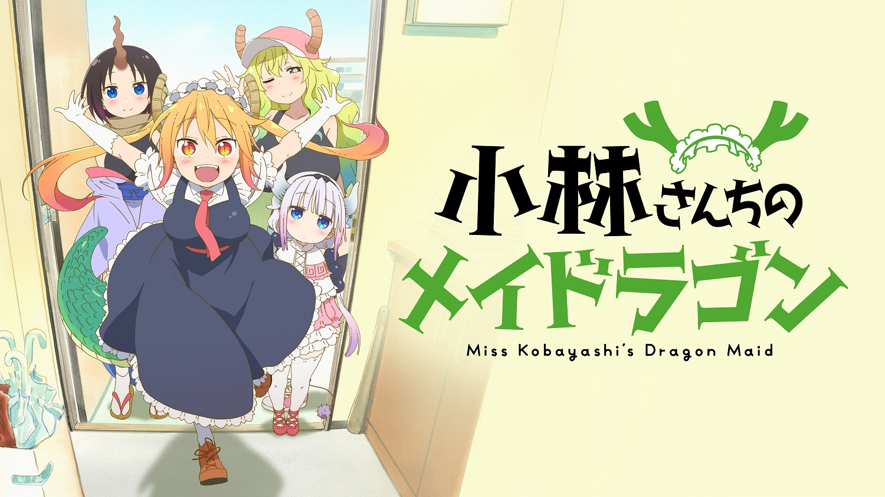
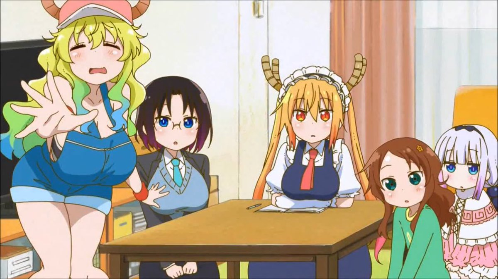

Miss Kobayashi's Dragon Maid (小林さんちのメイドラゴン Hepburn: Kobayashi-san Chi no Meidoragon) is a Japanese manga series written and illustrated by Coolkyoushinja. The series began serialization in Futabasha's Monthly Action magazine in May 2013, and is licensed in North America by Seven Seas Entertainment. Two spin-off manga, one by Mitsuhiro Kimura and the other by Ayami Kazama, are serialized in Monthly Action. An anime television series produced by Kyoto Animation aired in Japan between January and April 2017. A second anime season has been greenlit.

### Plot
As office worker Kobayashi gets ready for work, she is greeted by a large dragon right outside her front door. The dragon immediately transforms into a human girl in a maid outfit, and introduces herself as Tohru. It turns out that during a drunken excursion into the mountains the night before, Kobayashi had encountered the dragon, who claims to have come from another world. Subsequently, Kobayashi had removed a holy sword from Tohru's back, earning her gratitude. With Tohru having no place to stay, Kobayashi offers to let the dragon stay at her home and become her personal maid, to which she agrees. Despite being efficient at housework, Tohru's unorthodox methods of housekeeping often end up scaring Kobayashi and bringing more trouble than help. Additionally, Tohru's presence attracts other dragons, gods, and mythical beings to her new home.

### Video



Miss Kobayashi's Dragon Maid PV 1



Miss Kobayashi's Dragon Maid PV 2

### Anime
The wraparound cover of the fourth volume of the series revealed that an anime television series adaptation had been greenlit. The series is being directed by Yasuhiro Takemoto at Kyoto Animation and aired in Japan between 11 January and 6 April 2017. Yuka Yamada is writing the scripts, Miku Kadowaki is the character designer, Nobuaki Maruki is the chief animation director, and the music is composed by Masumi Itō. Crunchyroll simulcast the series as it aired while Funimation released an English dubbed version from February 1, 2017. An original video animation episode will be released on the seventh Blu-ray/DVD compilation volume on 20 September 2017. The opening theme is "Aozora no Rhapsody" (青空のラプソディ, "Blue Sky Rhapsody") by Fhána, and the ending theme is "Ishukan Communication" (イシュカン・コミュニケーション, "Interspecies Communication") by Yūki Kuwahara, Maria Naganawa, Minami Takahashi, and Yūki Takada. Madman Entertainment will import Funimation's release into Australia and New Zealand. A second season was announced with the release of the eighth manga volume.