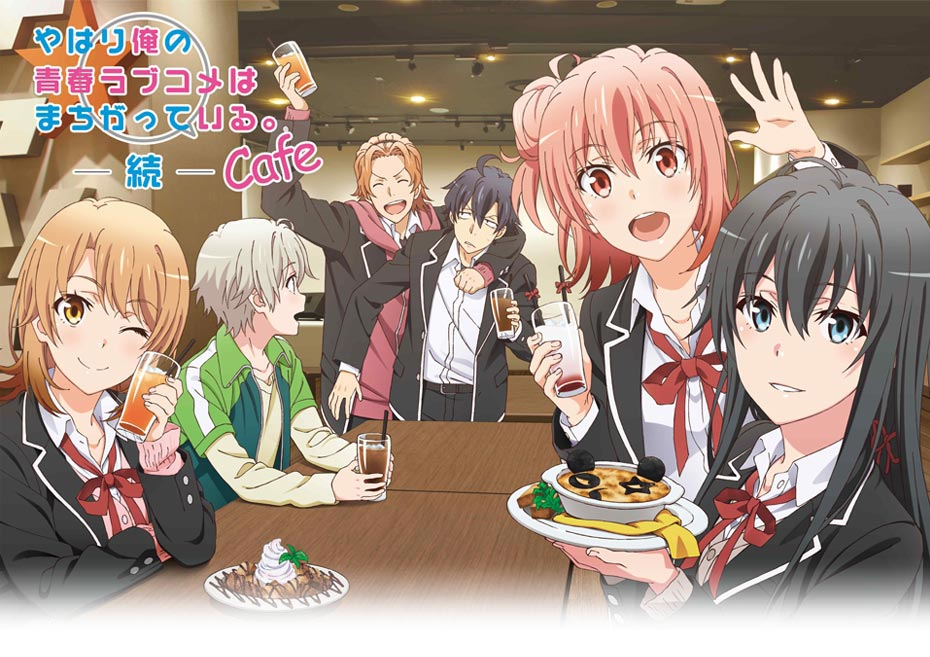
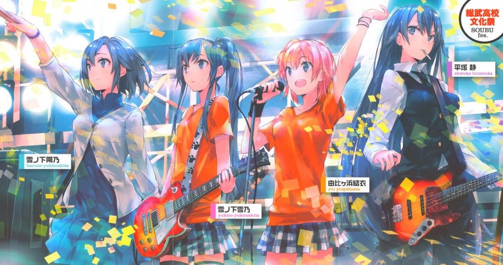
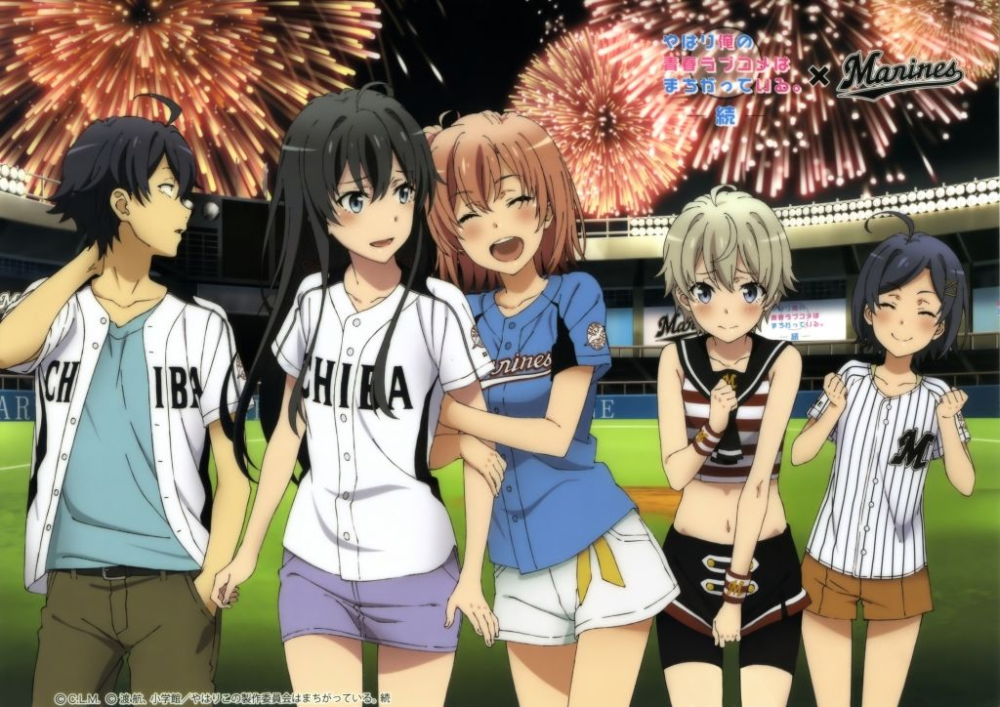

My Youth Romantic Comedy Is Wrong, As I Expected (Japanese: やはり俺の青春ラブコメはまちがっている。, Hepburn: Yahari Ore no Seishun Rabukome wa Machigatteiru.), abbreviated as OreGairu (俺ガイル) and Hamachi (はまち), and also known as My Teen Romantic Comedy SNAFU, is a Japanese light novel series written by Wataru Watari and illustrated by Ponkan8. The series follows Hachiman Hikigaya, an extremely pessimistic, close-minded, and realistic teen, who is forced by his teacher to join the school's service club, working with two girls who have their own personal issues to offer help and advice to others while dealing with their inner conflicts.

There are three manga adaptations and two anthology volumes. It has been adapted into an anime television series, which aired between April 4 and June 27, 2013 and was followed by a second season which aired between April 2 and June 25, 2015, as well as an upcoming third and final season set to premiere in April 2020. A video game, titled Yahari Game demo Ore no Seishun Rabukome wa Machigatteiru. and published by 5pb., for the PlayStation Vita was released on September 19, 2013. A second video game also by 5pb was released on October 27, 2016.

### Plot
The pragmatic Hachiman Hikigaya, Yukino Yukinoshita and friendly Yui Yuigahama, despite their varying personalities and ideals, offer help and advice to others as part of their school's Service Club. The story largely depicts various social situations faced by teens in a high school setting and the psychology driving their interactions.

### Video


My Teen Romantic Comedy SNAFU (season 1) CM 1



My Teen Romantic Comedy SNAFU (season 1) CM 2



My Teen Romantic Comedy SNAFU (season 1) PV 1



My Teen Romantic Comedy SNAFU (season 2) CM 1



My Teen Romantic Comedy SNAFU (season 2) CM 2



My Teen Romantic Comedy SNAFU (season 2) PV 1



My Teen Romantic Comedy SNAFU (season 2) PV 2



My Teen Romantic Comedy SNAFU (season 3) PV 1

### Anime
A 13-episode anime television series, directed by Ai Yoshimura and produced by Brain's Base, aired between April 5 and June 21, 2013, with an additional anime-original episode with writing by Wataru Watari following the series on June 27, 2013. The series was simulcast with English subtitles by Crunchyroll. An OVA episode on Blu-ray Disc was bundled with the limited edition of the video game, released on September 19, 2013. The opening theme is "Yukitoki" (ユキトキ) by Nagi Yanagi and the ending theme is "Hello Alone" by Saori Hayami and Nao Tōyama. The anime has been licensed by Sentai Filmworks in North America and Madman Entertainment in Australia and New Zealand.

A second season was announced by Shogakukan in 2014. The season, titled "Yahari Ore no Seishun Love Come wa Machigatteiru. Zoku", is produced by Feel and directed by Kei Oikawa, with character designs by Yuichi Tanaka and series composition by Shōtarō Suga. It aired between April 3 and June 26, 2015. The opening theme is "Harumodoki" (春擬き) by Yanagi. The ending theme is "Everyday World." (エブリデイワールド) by Yukino Yukinoshita (Hayami) and Yui Yuigahama (Tōyama). The second season has been licensed by Sentai Filmworks. An OVA episode, titled Undoubtedly, Girls Are Made of Sugar, Spice, and Something Nice (きっと、女の子はお砂糖とスパイスと素敵な何かでできている, Kitto, Onna no Ko wa Osatō to Spice to Suteki na Nanika de Dekiteiru), is bundled with the limited edition of the second video game, which was released on October 27, 2016.

A third and final season was announced by Shogakukan on March 18, 2019. Feel is returning to animate the third season, with Kei Oikawa returning as director, Keiichirō Ōchi replacing Shōtarō Suga as series composer, and Yuichi Tanaka returning as character designer. The season, titled "Yahari Ore no Seishun Love Come wa Machigatteiru. Kan", is set to premiere in April 9, 2020. The opening theme is by Yanagi, and the ending theme is by Yukino Yukinoshita (Hayami) and Yui Yuigahama (Tōyama).

On April 2, 2019, Sentai Filmworks confirmed on Twitter that the series will receive a dub. On July 5, Sentai announced both seasons 1 and 2 will be dubbed.

