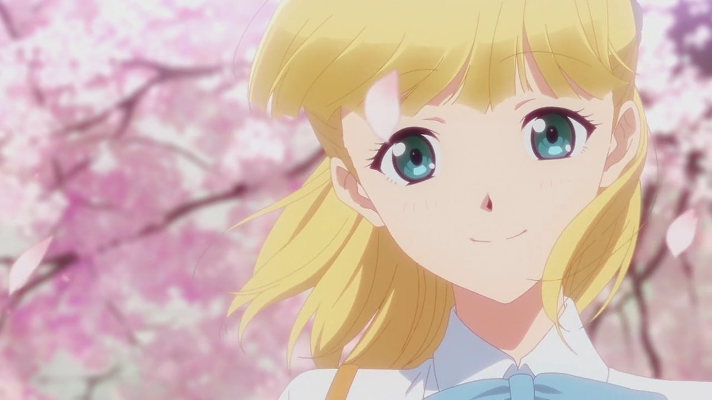

Tada Never Falls in Love (Japanese: 多田くんは恋をしない Hepburn: Tada-kun wa Koi wo Shinai) is a Japanese romantic comedy anime television series produced by Doga Kobo. It aired from April 5 to June 28, 2018. The series is licensed in North America by Sentai Filmworks.

### Plot
The story follows Mitsuyoshi Tada, a boy who has never known love. He is taking pictures of the cherry blossoms in full bloom when he meets Teresa Wagner, a transfer student from a fictional European country called Larsenburg (ラルセンブルク Rarusenburuku). It seems that she separated from her travel companion upon arriving in Japan. Tada helps her and brings her to his grandfather's coffee shop. Teresa's travel companion and bodyguard Alec arrives and beats up Kaoru misunderstanding him as chasing after Teresa. They discover that the hotel they're supposed to be staying in is actually next to Tada's cafe. The next day, they enroll in Tada's school and are in the same class. Alec agrees on joining the Photography Club on Teresa's request that she also wants to take great pictures. Mitsuyoshi is actually an aspiring photographer and wants to become like his father, who was a famous photographer. Mitsuyoshi lost his parents in a car accident during their childhood. The one last photo his father took and the camera were the only things that came back. The story focuses on the adventures of Tada and his friends and their building relationships.

### Video


Tada Never Falls in Love PV 1



Tada Never Falls in Love PV 2

### Anime
The 13-episode original anime television series by Doga Kobo aired from April 5 to June 28, 2018. The series is directed by Mitsue Yamazaki, with series composition by Yoshiko Nakamura, character designs by Junichiro Taniguchi and music by Yukari Hashimoto. The opening theme is Otomodachi firumu (オトモダチフィルム "Otomodachi Film") performed by Masayoshi Ōishi, and the ending theme is rabu songu (ラブソング Love Song) performed by Manaka Iwami as her character Teresa Wagner. Sentai Filmworks has licensed the series and is streaming it on HIDIVE.

