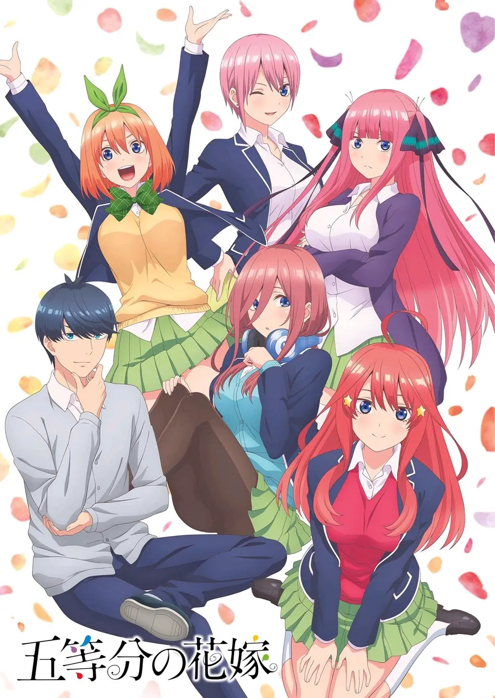

The Quintessential Quintuplets (Japanese: 五等分の花嫁, Hepburn: Go-Tōbun no Hanayome, lit. "Five Equal Bride(s)") is a Japanese manga series written and illustrated by Negi Haruba. It was serialized in Kodansha's Weekly Shōnen Magazine from August 2017 to February 2020. The series follows the daily life of a high school student Futaro Uesugi who is hired as a private tutor for a group of quintuplets, Ichika, Nino, Miku, Yotsuba and Itsuki Nakano, who perform poorly academically. At the very beginning of the story, it is indicated Futaro will marry with one of the Nakano quintuplets but the identity of the bride is unknown until near the end of the story.

An anime television series adaptation produced by Tezuka Productions aired from January to March 2019 on TBS and other channels. A second season by Bibury Animation Studios premiered on January 2021.

The series is published in English by Kodansha USA under the Kodansha Comics imprint. The anime series is licensed in North America under a Crunchyroll–Funimation partnership.

The series is a commercial success, being the 5th best selling manga in 2019, and the 3rd best selling manga in the first half of 2020 in Japan. In 2019, the manga won the award for the shōnen category at the 43rd annual Kodansha Manga Awards.

### Plot
High school student Futaro Uesugi is an academically gifted student that leads a difficult life — his mother has died, he has no friends, and on top of all that, his father has incurred a large amount of debt.

An opportunity presents itself when the rich Nakano family transfers to his school. Futaro is promptly hired as a highly-paid tutor. However, much to Futaro's dismay, he discovers that his five charges — identical quintuplet sisters of varied personalities — have no interest in studying at all and have abysmal grades. Some of the quintuplets are against having Futaro, whom they view as a stranger, in their apartment, but Futaro's diligent tenacity gradually convinces those girls to accept him and to improve their grades.

Throughout the series, Futaro develops special relationships with each of the quintuplets. Through a flashforward, it is revealed that he eventually marries one of the quintuplets, though her identity is not revealed until near the end of the story.

### Video


The Quintessential Quintuplets CM 1



The Quintessential Quintuplets CM 2



The Quintessential Quintuplets PV



The Quintessential Quintuplets ∬ CM 1



The Quintessential Quintuplets ∬ CM 2



The Quintessential Quintuplets ∬ PV 1



The Quintessential Quintuplets ∬ PV 2



The Quintessential Quintuplets ∬ PV 3

### Anime
An anime television series adaptation was announced in the combined 36th and 37th issue of Weekly Shōnen Magazine on August 8, 2018. The series is directed by Satoshi Kuwabara and written by Keiichirō Ōchi, featuring animation by Tezuka Productions, character designs by Michinosuke Nakamura and Gagakuga, and music by Natsumi Tabuchi, Hanae Nakamura, and Miki Sakurai. The series aired from January 10 to March 28, 2019 on the TBS, SUN, and BS-TBS channels. The series ran for 12 episodes. Crunchyroll streamed the series with Funimation providing the English dub as it airs.

A second season was announced in a special event for the first season on May 5, 2019. Kaori is replacing Satoshi Kuwabara as the director of the season, and Keiichirō Ōchi is returning to write the scripts. Bibury Animation Studios is replacing Tezuka Productions as the animation studio. The season was originally scheduled to premiere in October 2020, but due to issues caused by the COVID-19 pandemic the anime premiered on January 8, 2021.

For the first season, Kana Hanazawa, Ayana Taketatsu, Miku Itō, Ayane Sakura, and Inori Minase performed the opening theme song "Quintuplet Feelings" (五等分の気持ち, Gotōbun no Kimochi) as the group The Nakano Family's Quintuplets (中野家の五つ子, Nakano-ke no Itsutsugo), while Aya Uchida performed the ending theme song "Sign".

For the second season, The Nakano Family's Quintuplets will perform the opening theme song "Gotōbun no Katachi" and the ending theme song "Hatsukoi".

