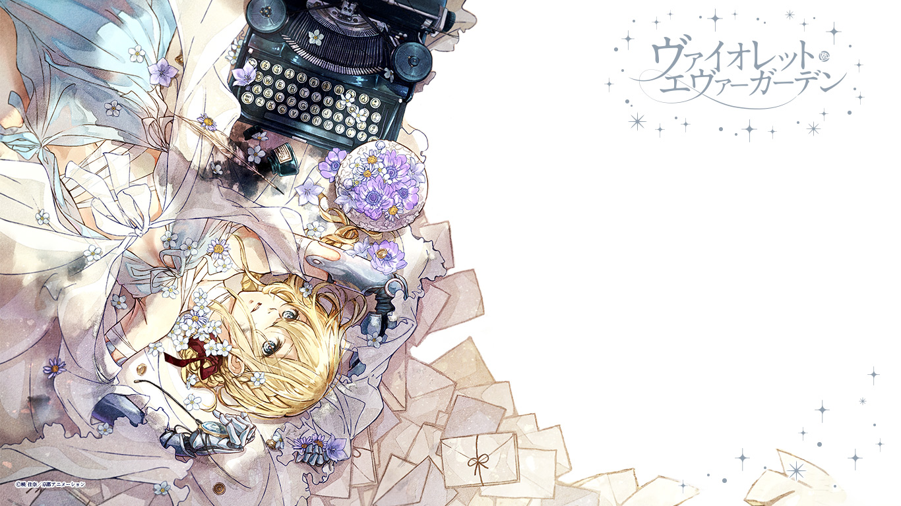

Violet Evergarden (ヴァイオレット・エヴァーガーデン) is a Japanese light novel series written by Kana Akatsuki and illustrated by Akiko Takase. It won the grand prize in the fifth Kyoto Animation Award's novel category in 2014, the first ever work to win a grand prize in any of the three categories (novel, scenario, and manga). Kyoto Animation published the first light novel on December 25, 2015 under their KA Esuma Bunko imprint.  A 13-episode anime television series adaptation by Kyoto Animation premiered in January 2018 with several advanced screenings taking place in 2017. An original video animation episode was released in July 2018, and a spin-off film will premiere in September 2019, with another anime film scheduled to premiere in January 2020.

### Plot
The story revolves around Auto Memory Dolls (自動手記人形 Jidō Shuki Ningyō): people initially employed by a scientist named Dr. Orland to assist his blind wife Mollie in writing her novels, and later hired by other people who needed their services. In the present time, the term refers to the industry of writing for others. The story follows Violet Evergarden's journey of reintegrating back into society after the war is over and her search for her life's purpose now that she is no longer a soldier in order to understand the last words her major, Gilbert, had told her: "I love you."

### Video


Violet Evergarden CM 0



Violet Evergarden CM 1



Violet Evergarden CM 2



Violet Evergarden PV 1



Violet Evergarden PV 2



Violet Evergarden PV 3



Violet Evergarden PV 4



Violet Evergarden 2020 PV

### Anime
The anime adaptation was first announced via a commercial of the light novel's first volume in May 2016. In June 2017, Kyoto Animation announced that Anime Expo, AnimagiC, and C3 AFA Singapore 2017 would host the world premiere of the first episode. The second episode was first screened at the KyoAni and Do Fan Days 2017 event on October 21, 2017, and the third episode in five theaters across Japan on December 10, 2017. The 13-episode anime aired from January 11 to April 5, 2018, in Japan. An original video animation episode was released on July 4, 2018, with the final Blu-ray and DVD volume. The series is directed by Taichi Ishidate at Kyoto Animation with the screenplay written by Reiko Yoshida. Akiko Takase designed the characters and Yota Tsuruoka handles the sound direction. The opening theme is "Sincerely" by True while the ending theme is "Michishirube" (みちしるべ, lit. "Guidepost") by Minori Chihara. Netflix began streaming the series worldwide on January 11, 2018, except for the United States and Australia, where they began streaming on April 5, 2018. Anime Limited acquired the series for home video distribution in the United Kingdom and Ireland, and premiered the first episode at MCM London Comic Con on October 28, 2017. Madman Entertainment acquired the home video distribution rights for the series in Australia and New Zealand.

When the Violet Evergarden Gaiden light novel was released, the jacket band announced that a "new project" was in progress and that it will be a completely new work for the anime. In July 2018, it was announced at a special event for the series that the aforementioned new project will be a brand new anime film scheduled to premiere in January 10, 2020. A spin-off film was announced to premiere on September 6, 2019. The film is being directed by the show's series director Haruka Fujita.

